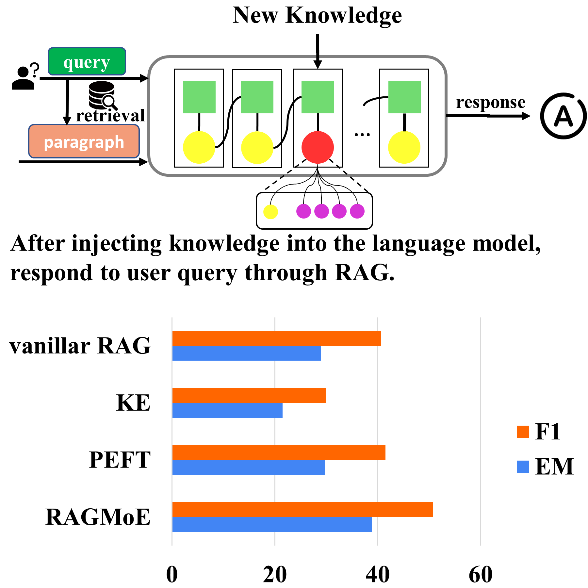

# Retrieval Augmented Editing Generation


### Retrieval & Data Source
The retrieval model uses the **DPR** model. The weights and NQ/TQA data can be obtained using the `./dpr/data/download.py` script. 

For details, please refer to the original [**DPR** repository](https://github.com/facebookresearch/DPR/tree/main).


### Re-ranker
We use the [**bge-reranker-v2-gemma**](https://huggingface.co/BAAI/bge-reranker-v2-gemma) as re-ranker base model in this work and extend our gratitude to its developers for their contributions to advancing re-ranking technologies.
1. Use the `./reranker/prepare_data.py` script to prepare the data for the re-ranker.
2. Training
3. After training, use the following code to merge model.
```bash
python -c "from FlagEmbedding.llm_reranker.merge import merge_llm; merge_llm('BAAI/bge-reranker-v2-gemma', model_dir, target_dir)"
```


### RAGMoE


An illustration of knowledge injection strategies for RAG models. 
The top part shows the process of injecting new "passage-level" knowledge into the LLM to facilitate responsive, retrieval-based answers. 
The bottom part compares the impact of various knowledge injection techniques -- the baseline RAG (vanilla RAG), advanced Knowledge-Editing (MALMEN method, Parameter-Efficient Fine-Tuning (LoRA method), and the proposed RAGMoE. KE and PEFT, which are two PU methods that directly modify the original model parameters, may negatively impact general and reasoning capabilities or fail to effectively inject knowledge. 
RAGMoE, which keeps original LLM parameters, makes noticeable improvements over RAG. 